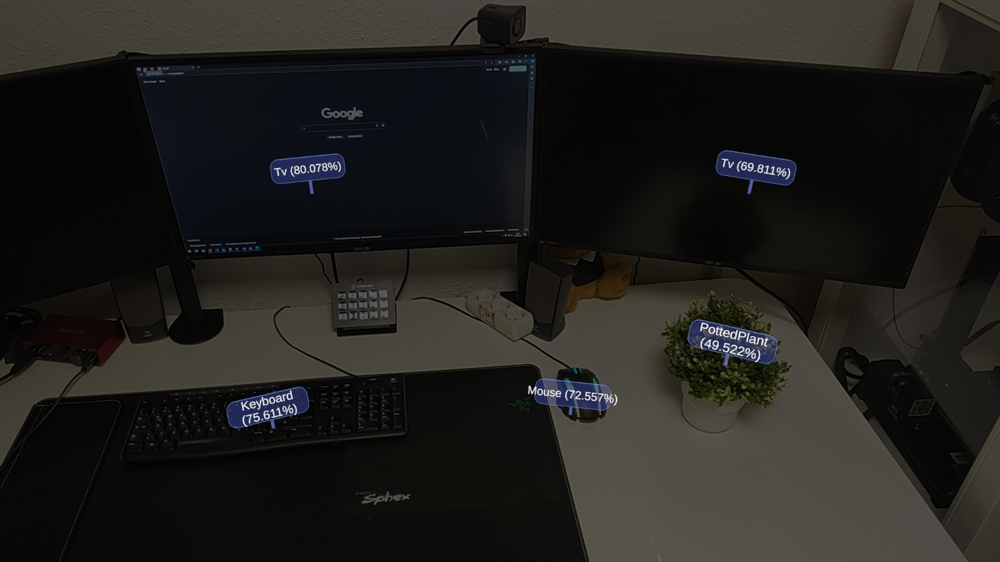
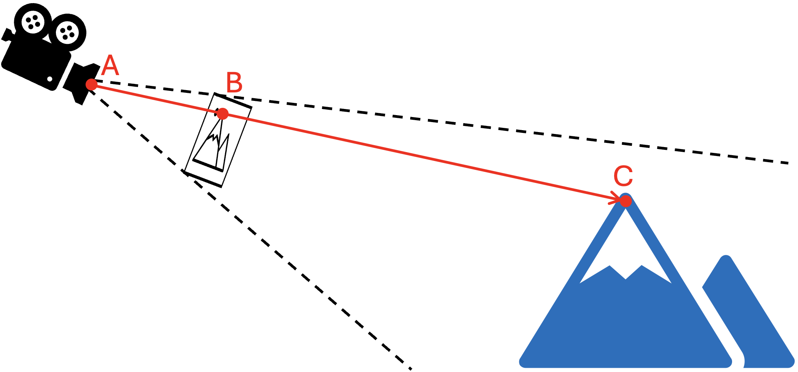

# 1. General

This Unity project is used for executing 2D image object recognition models on the HoloLens2 hardware for 3D object detection. As an example the YOLOv8n and Yolov10n models were used (the default models are included here).
The model is executed as soon as the application is started. The recognized objects are identified with a label, which displays the recognized class and the associated detection probability (as you can see in the image). This label is placed in the center of the detected object by shooting a sphere cast onto the spatial mesh of the environment.

By combining the 2D position of the objects in the image with the information about the position of the camera and the spatial mesh, it is possible to estimate the position of the object in the 3D space. Therefore, the image is virtually positioned in front of the camera on a scale that is aligned with the field of view of the camera. Referring the following image you can estimate the position by casting a sphere starting in the position of camera A and going through the position of the object in image B. The point of the collision with the spatial mesh C is the estimated position of the object in the 3D space.

### Detection of new objects / Removal of vanished objects
To reduce the error rate of recognisitions and increase robustness, an additional filter mechanism is integrated. A new object is only displayed in the user's field of view once it has been recognised in four consecutive model executions. 
Furthermore, objects are not removed immediately if they are not recognised in a model execution. The object is only removed if it has not been recognised in the user's field of vision for three seconds. If the object is not in the user's field of vision, it remains at his position.  

### Features based on detections
In this example code, a label and optional debug information is displayed for each recognized object.
If you would like to execute your own functionality based on the recognized objects, the method `TriggerDetectionActions` in the `YoloRecognitionHandler` class can be extended.

# 2. Settings & Parameters
Various settings can be changed using the hand menu. The parameters of the programm can be changed in the `Parameters` file. The following parameters are used in the context of the implementation:

### Model parameters
- `ModelImageResolution`: In this parameter the resolution of the model input image is defined. The YOLO default input size is 640 x 640.
- `ModelVersion`: This parameter destinguishes between the used version of YOLO. Currently v8 and v10 are supported.
- `OverlapThreshold`: Defines when two boundingboxes describe the same object (measured as IoU).

### Performance presets
These values describe the presets stored in the hand menu for the performance of the model execution. The value describes the number of layers that are executed in every frame. 
- `LayersHigh`: Preset for high model execution rate, but low framerate.
- `LayersLow`: Preset for low model execution rate, but higher framerate.

### Model recognition accuracy
These values describe the presets stored in the hand menu for the accuracy of the model recognitions. The value describes the minimum accuracy that an individual recognition must have in order to be perceived as such.
- `ThresholdHigh`
- `ThresholdMedium`
- `ThresholdLow`

### Debug options
These options can be activated in the hand menu for debugging purposes.
- `Bounding boxes`: Visualizes the bounding boxes of the detected objects on the virtual projection plane.
- `Model debug image`: Displays the image that is feed into the model and draws bounding boxes for the detections inside the image.
- `Projection cubes`: Visualizes fixed positions in the image (marked by colored pixels in the debug image) as cubes at the projected positions on the virtual projection plane. Can be used to determine parameters for the projection. The aim is to ensure that the positions in the room match those in the image.
- `Debug sphere cast`: Visualizes the shooted sphere casts.

### Position calculator parameters (2D => 3D)
This group of parameters deals with the 3D position estimation based on the 2D recognition in the image.
The values for these parameters were determined using the debug options. 
- `VirtualProjectionPlaneWidth`: This describes the width of the projection plane (previously denoted as B in the image).
- `MaxSphereLength`: Maximum distance at which objects are displayed.
- `SphereCastSize`: Size of the cast from the HoloLens to the Mesh (When this parameter is bigger, it is easier to hit smaller objects).
- `HeightOffset`: Offset of the projection plane.
- `SphereCastOffset`: Offset of the start position of the sphere casts. This represents the position of the camera of the HoloLens relative to the eyes.

### Parameters for features based on Object Recognition
- `MinTimesSeen`: Number of model execution where the model need to detect an object before it is visible to the user.
- `ObjectTimeOut`: Time in seconds which the object needs to be abscent such that an object is deleted.
- `MaxIdenticalObject`: Maximum distance between two objects of the same class, so that they are recognised as the same object in different detections.

# 3. Custom model

To use your own model, the following steps must be carried out:
1. Train your own [YOLOv8n](https://docs.ultralytics.com/modes/train/#usage-examples) or [YOLOv10n](https://docs.ultralytics.com/models/yolov10/#usage-examples) model
2. Export the trained model to onnx, see [Yolov8](https://docs.ultralytics.com/modes/export/#usage-examples) / [Yolov10](https://github.com/THU-MIG/yolov10#Export)
3. Copy the trained model to the `Assets/Models` folder
4. Update the linked model in the `YoloObjectLabeler` prefab or directly in the scene
5. Update the detected classes in the `ObjectClass` script
- **Note:** Must be the same order as in config.yaml for training
6. Update the `ModelImageResolution` in the `Parameters` script if you changed the input resolution of the model (default: 640 x 640)

Performance recommendations:
1. The fewer classes the model has to differentiate between, the better the performance. The default model has quite a few classes and is therefore relatively slow
2. Quantization to 16 bit has little to no effect (8 bit has not been tried yet)

In addition to YOLO, other onnx models should also be usable.
For this, the logic for reading the model output tensor in the `YoloModelOutputProcessor` class has to be adapted as well.

# 4. Deployment to HoloLens

To install the latest version of the app on the HoloLens, perform the following steps:
1. Install required software: 
   - git
   - Unity version 2021.3.22f1 with the `Universal Windows Platform Build Support` module
     - Recommendation: Do not install Visual Studio as a DevTool with Unity, since only Visual Studio 2019 is available
   - Visual Studio 2017 or greater (Recommendation: 2022) with the following workloads and components (can be modified via the Visual Studio Installer):
     - `.NET desktop development` workload
     - `Desktop development with C++` workload
     - `Universal Windows Platform development` workload
       - Make sure that under `installation details` the following components are included for the workload:
         - `USB-Connectivity` 
         - `C++ (vNNN) Universal Windows Platform tools` (newest version)
         - any `Windows SDK` (Recommendation: Windows 11)
     - `Game development with Unity` workload
     - `C++ Universal Windows Platform support for vNNN build tools (ARM64)`component
     - `MSVC vNNN - VS NNNN C++ ARM build tools (Latest)` component
     - `MSVC vNNN - VS NNNN C++ ARM64 build tools (Latest)` component
2. Activate `Developer Mode` on your local machine
3. In the HoloLens go to: `Settings`->`Update & Security`->`For developers` and enable `Use Developer Features` and `Device Discovery`
4. Clone the git repo
5. Open the project in Unity
6. In Unity, select `File`->`Build Settings`
   - Check that `HoloLensYOLOObjectDetectionScene` is selected as Scenes in Build
   - Check that `Universal Windows Platform` is selected as Platform
   - Check that `ARM-64` is selected as `Build Target Platform`
   - *Optional:* Change the name of the app by clicking on `Player Settings...` and enter a custom name as `Product name` and as `Package name` (`Universal Windows Platform`->`Publishing settings`)
   - Click on Build and select an target folder (Recommendation: empty folder)
   - **Note:** If someone else has already installed an app with the same name on the HoloLens, it can sometimes happen that this version is not overwritten. Renaming is then necessary. This is also the case when you getting the error code `0x80070057` during deployment
7. Open the built solution in Visual Studio
8. In Visual Studio select `Release`, `ARM64` and `Device` as a build target (in the top tool bar)
9. Connect the HoloLens via a USB cable with the PC
   - **Note:** The HoloLens should appear in the Windows Explorer
10. In Visual Studio click on `Build`
   - **Note:** When deploying to the HoloLens from a PC for the first time, a PIN prompt appears during the deployment process. This PIN can be found in the HoloLens as follows: `Settings`->`Update & Security`->`For developers`->Click on `Pair` under `Device discovery`

# 5. Windows device portal

The Windows Device Portal can be used, for example, to stream the HoloLens image to the PC or to analyse the performance of an app in the HoloLens.
To call this up, carry out the following steps:
1. Connect the HoloLens via a USB cable with the PC or connect the PC and the HoloLens to the same WLAN network
2. In the HoloLens go to: `Settings`->`Update & Security`->`For developers` and enable the `Device Portal`
3. In the HoloLens go to: `Settings`->`Update & Security`->`For developers` and enter the first URL displayed under `Device Portal` in the browser on the PC
4. The video stream is available at `Views`->`Mixed Reality Capture`->`Live preview`

# 6. Debugging

## On PC
To test the model execution in Unity, the *virtual camera* of [OBS](https://obsproject.com/) can be used as camera input of the model. 
In this case, the objects are projected in a fixed distance to the user relative to the position in the image.
## On HoloLens
In order to debug your C# code directly on the HoloLens, follow these steps (strongly based on https://stackoverflow.com/a/59990792):
1. In the `Project Settings`->`Player` enable the capabilities `PrivateNetworkClientServer` and `InternetClientServer`
2. In the `Build Settings` enable `Development Build`, `ScriptDebugging` and `Wait For Managed Debugger`.
   - **Note:** Changing the `Build configuration` to `Debug` increases the chance that debugging will work successfully. However, this further reduces performance. If this option is selected, `Debug` must also be selected instead of Release when deploying from Visual Studio.
3. Build and deploy your project as usual.
4. Connect the PC and the HoloLens to the same WLAN (WLAN must support multicast -> Recommendation: Create a hotspot with the PC)
5. Disconnect the USB cable from the HoloLens and start the App -> A pop-up occurs
6. Open the `HoloLens-YOLO-Object-Detection.sln` in Visual Studio and click on `Debug`->`Attach Unity Debugger`. In the list the HoloLens should occur -> select the HoloLens
    - If the `HoloLens-YOLO-Object-Detection.sln` is not part of your repository folder:
        - In Unity select `Edit`->`Preferences`->`External tools`
        - Select Visual Studio as `External Script Editor`.
        - Select `Embedded packages` and `Local packages` under `Generate .csproj files for:`
        - Click on `Regenerate project files`
7. In the HoloLens close the popup
8. Set break points in Visual Studio and debug your app.

**Note:** The app is significantly slower when debugging and it also takes longer to deploy the app.

# 7. Acknowledgment
The project was inspired by [YoloHolo](https://github.com/LocalJoost/YoloHolo/tree/main) and parts of the code are based on it.
